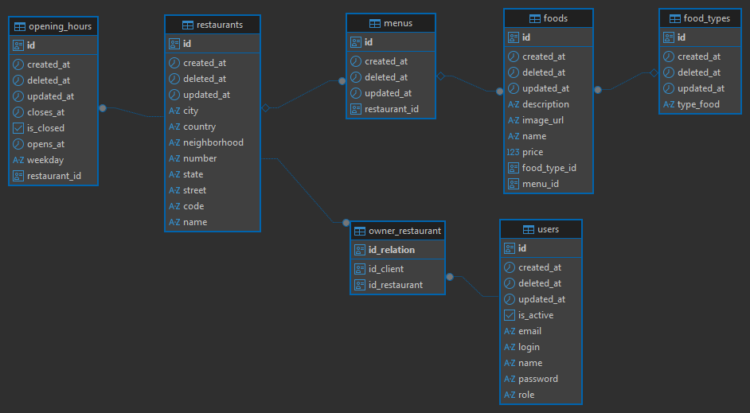
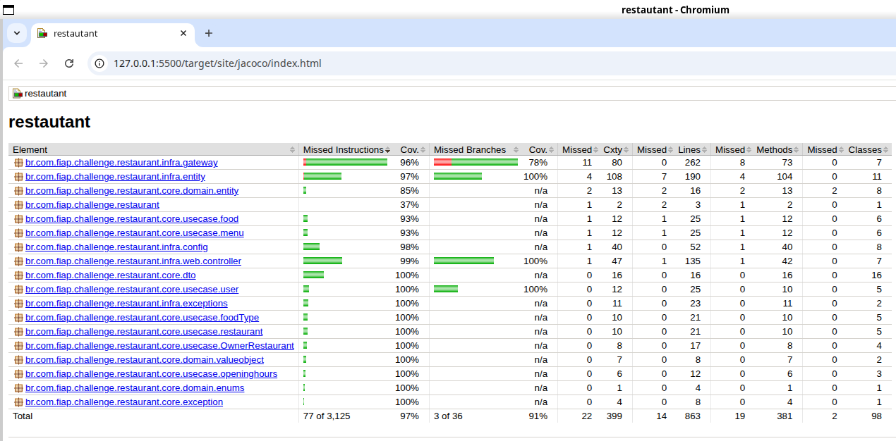

# Projeto: Sistema de Gestão de Restaurantes - Tech Challenge Fase 02
  
## Equipe: Lista dos nomes e RMs dos alunos
  
| Nome | RM |
| --- | --- |
| Emerson Pereira da Silva | RM367268 |
| Levi Aparecido do Santos | RM369031 |
| Luiz Octavio Tassinari Saraiva | RM367408|
| Rhayana Lacerda Gomes | RM367798 |
| Vinicius Padovam Valentim | RM367199|

Repositório do projeto: https://github.com/Equipe-3-FIAP-POS-GRAD-ARC-JAVA/tech-challenge-fase-02

# 1. Introdução

# 1.1 Descrição do problema

Na nossa região, um grupo de restaurantes decidiu contratar estudantes para construir um sistema de gestão para seus estabelecimentos. Essa decisão foi motivada pelo alto custo de sistemas individuais, o que levou os restaurantes a se unirem para desenvolver um sistema único e compartilhado. Esse sistema permitirá que os clientes escolham restaurantes com base na comida oferecida, em vez de se basearem na qualidade do sistema de gestão. O objetivo é criar um sistema robusto que permita a todos os restaurantes gerenciar eficientemente suas operações, enquanto os clientes poderão consultar  informações,  deixar  avaliações  e  fazer  pedidos  online.  Devido  à limitação de  recursos financeiros,  foi  acordado  que  a  entrega  do  sistema  será realizada  em  fases,  garantindo  que  cada  etapa  seja  desenvolvida  de  forma cuidadosa e eficaz. 
A divisão em fases possibilitará uma implementação gradual e controlada, permitindo ajustes e melhorias contínuas conforme o sistema for sendo utilizado e avaliado pelos restaurantes e clientes. 

# 1.2 Objetivo desta fase

Essa fase  expande  o sistema ao  incluir a gestão  dos  tipos  de usuários, cadastro de restaurantes e cardápios, reforçando práticas de desenvolvimento e estruturação de código limpo. Além disso, são incluídos requisitos técnicos para garantir que o sistema mantenha alta qualidade e organização, com suporte para documentação, testes automatizados e infraestrutura Docker para uma execução integrada.


# 2. Arquitetura do Sistema

# 2.1 Visão Geral da Arquitetura
O sistema foi desenvolvido utilizando a arquitetura limpa (Clean Architecture), que promove a separação clara entre as diferentes camadas do aplicativo. A arquitetura é dividida em duas camadas principais: Core e Infra.

# 2.2 Camada Core
A camada Core é responsável pelas regras de negócio do sistema e é independente de qualquer framework ou tecnologia externa.

# 2.3 Camada Infra
A camada Infra é responsável por adaptar as regras de negócio para funcionar com frameworks e tecnologias externas, como o Spring Boot e o banco de dados.

# 2.4 Modelagem do Banco de Dados

O banco de dados foi modelado para suportar as funcionalidades do sistema, incluindo tabelas para usuários, restaurantes e cardápios.



```sql
CREATE TABLE public.food_types (
	id uuid NOT NULL,
	created_at timestamptz(6) NOT NULL,
	deleted_at timestamptz(6) NULL,
	updated_at timestamptz(6) NULL,
	type_food varchar(255) NULL,
	CONSTRAINT food_types_pkey PRIMARY KEY (id)
);

CREATE TABLE public.restaurants (
	id uuid NOT NULL,
	created_at timestamptz(6) NOT NULL,
	deleted_at timestamptz(6) NULL,
	updated_at timestamptz(6) NULL,
	city varchar(255) NULL,
	country varchar(255) NULL,
	neighborhood varchar(255) NULL,
	"number" varchar(255) NULL,
	state varchar(255) NULL,
	street varchar(255) NULL,
	code varchar(255) NULL,
	"name" varchar(255) NULL,
	CONSTRAINT restaurants_pkey PRIMARY KEY (id)
);

CREATE TABLE public.users (
	id uuid NOT NULL,
	created_at timestamptz(6) NOT NULL,
	deleted_at timestamptz(6) NULL,
	updated_at timestamptz(6) NULL,
	is_active bool NOT NULL,
	email varchar(180) NOT NULL,
	login varchar(80) NOT NULL,
	"name" varchar(120) NOT NULL,
	"password" varchar(255) NOT NULL,
	"role" varchar(40) NOT NULL,
	CONSTRAINT uk6dotkott2kjsp8vw4d0m25fb7 UNIQUE (email),
	CONSTRAINT ukow0gan20590jrb00upg3va2fn UNIQUE (login),
	CONSTRAINT users_pkey PRIMARY KEY (id),
	CONSTRAINT users_role_check CHECK (((role)::text = ANY ((ARRAY['ADMIN'::character varying, 'OWNER_RESTAURANT'::character varying, 'CUSTOMER'::character varying])::text[])))
);

CREATE TABLE public.menus (
	id uuid NOT NULL,
	created_at timestamptz(6) NOT NULL,
	deleted_at timestamptz(6) NULL,
	updated_at timestamptz(6) NULL,
	restaurant_id uuid NULL,
	CONSTRAINT menus_pkey PRIMARY KEY (id),
	CONSTRAINT fk49thmnytvo47ttv4ggtwo9rrj FOREIGN KEY (restaurant_id) REFERENCES public.restaurants(id)
);

CREATE TABLE public.opening_hours (
	id uuid NOT NULL,
	created_at timestamptz(6) NOT NULL,
	deleted_at timestamptz(6) NULL,
	updated_at timestamptz(6) NULL,
	closes_at time(6) NULL,
	is_closed bool NOT NULL,
	opens_at time(6) NULL,
	weekday varchar(10) NOT NULL,
	restaurant_id uuid NOT NULL,
	CONSTRAINT opening_hours_pkey PRIMARY KEY (id),
	CONSTRAINT opening_hours_weekday_check CHECK (((weekday)::text = ANY ((ARRAY['MONDAY'::character varying, 'TUESDAY'::character varying, 'WEDNESDAY'::character varying, 'THURSDAY'::character varying, 'FRIDAY'::character varying, 'SATURDAY'::character varying, 'SUNDAY'::character varying])::text[]))),
	CONSTRAINT fk5dgcr0nmedj2g2ru4lqdld48n FOREIGN KEY (restaurant_id) REFERENCES public.restaurants(id)
);

CREATE TABLE public.owner_restaurant (
	id_relation uuid NOT NULL,
	id_client uuid NOT NULL,
	id_restaurant uuid NOT NULL,
	CONSTRAINT owner_restaurant_pkey PRIMARY KEY (id_relation),
	CONSTRAINT uk_owner_restaurant UNIQUE (id_client, id_restaurant),
	CONSTRAINT fkag9mbhqvrr4swkfxudglw33wo FOREIGN KEY (id_restaurant) REFERENCES public.restaurants(id),
	CONSTRAINT fkji28sngubhm32phnmv8augscd FOREIGN KEY (id_client) REFERENCES public.users(id)
);

CREATE TABLE public.foods (
	id uuid NOT NULL,
	created_at timestamptz(6) NOT NULL,
	deleted_at timestamptz(6) NULL,
	updated_at timestamptz(6) NULL,
	description varchar(255) NULL,
	image_url varchar(255) NULL,
	"name" varchar(255) NULL,
	price numeric(38, 2) NULL,
	food_type_id uuid NULL,
	menu_id uuid NULL,
	CONSTRAINT foods_pkey PRIMARY KEY (id),
	CONSTRAINT fkfn4qwtat9ihgf22e8ky8806o9 FOREIGN KEY (menu_id) REFERENCES public.menus(id),
	CONSTRAINT fkteg3f0l6cndtbn3nsbr1tmxcl FOREIGN KEY (food_type_id) REFERENCES public.food_types(id)
);

```

# 3. Descrição dos Endpoints da API

Os endpoints da API foram projetados para permitir a gestão completa dos usuários, restaurantes, cardápios e alimentos. A seguir estão os endpoints disponíveis:

## 3.1 Users (Usuários)

Operações CRUD para gestão de usuários (Proprietários, Clientes e Administradores).

| Endpoint | Método | Descrição | Controller |
|----------|--------|-----------|------------|
| `/api/users` | POST | Criar novo usuário (ADMIN, OWNER_RESTAURANT ou CUSTOMER) | UserController |
| `/api/users` | GET | Listar todos os usuários | UserController |
| `/api/users/{id}` | GET | Buscar usuário por ID | UserController |
| `/api/users/{id}` | PUT | Atualizar dados de um usuário | UserController |
| `/api/users/{id}` | DELETE | Remover um usuário | UserController |

## 3.2 Restaurants (Restaurantes)

Operações CRUD para gestão de restaurantes.

| Endpoint | Método | Descrição | Controller |
|----------|--------|-----------|------------|
| `/api/restaurants` | POST | Criar novo restaurante | RestaurantController |
| `/api/restaurants` | GET | Listar todos os restaurantes | RestaurantController |
| `/api/restaurants/{id}` | GET | Buscar restaurante por ID | RestaurantController |
| `/api/restaurants/{id}` | PUT | Atualizar dados de um restaurante | RestaurantController |
| `/api/restaurants/{id}` | DELETE | Remover um restaurante | RestaurantController |

## 3.3 Menus (Cardápios)

Operações CRUD para gestão de cardápios vinculados aos restaurantes.

| Endpoint | Método | Descrição | Controller |
|----------|--------|-----------|------------|
| `/api/menus` | POST | Criar novo cardápio para um restaurante | MenuController |
| `/api/menus` | GET | Listar todos os cardápios | MenuController |
| `/api/menus/{id}` | GET | Buscar cardápio por ID | MenuController |
| `/api/menus/restaurant/{restaurantId}` | GET | Listar todos os cardápios de um restaurante | MenuController |
| `/api/menus/{id}` | PUT | Atualizar um cardápio | MenuController |
| `/api/menus/{id}` | DELETE | Remover um cardápio | MenuController |

## 3.4 Food Types (Tipos de Alimento)

Operações CRUD para gestão de tipos/categorias de alimentos (ex: Entrada, Prato Principal, Sobremesa).

| Endpoint | Método | Descrição | Controller |
|----------|--------|-----------|------------|
| `/api/food-types` | POST | Criar novo tipo de alimento | FoodTypeController |
| `/api/food-types` | GET | Listar todos os tipos de alimento | FoodTypeController |
| `/api/food-types/{id}` | GET | Buscar tipo de alimento por ID | FoodTypeController |
| `/api/food-types/{id}` | PUT | Atualizar um tipo de alimento | FoodTypeController |
| `/api/food-types/{id}` | DELETE | Remover um tipo de alimento | FoodTypeController |

## 3.5 Foods (Alimentos/Pratos)

Operações CRUD para gestão de alimentos/pratos nos cardápios.

| Endpoint | Método | Descrição | Controller |
|----------|--------|-----------|------------|
| `/api/foods` | POST | Adicionar novo alimento ao cardápio | FoodController |
| `/api/foods` | GET | Listar todos os alimentos | FoodController |
| `/api/foods/{id}` | GET | Buscar alimento por ID | FoodController |
| `/api/foods/menu/{menuId}` | GET | Listar todos os alimentos de um cardápio | FoodController |
| `/api/foods/{id}` | PUT | Atualizar dados de um alimento | FoodController |
| `/api/foods/{id}` | DELETE | Remover um alimento | FoodController |

## 3.6 Opening Hours (Horários de Funcionamento)

Operações para gestão de horários de funcionamento dos restaurantes.

| Endpoint | Método | Descrição | Controller |
|----------|--------|-----------|------------|
| `/api/opening-hours` | POST | Criar horário de funcionamento para um restaurante | OpeningHoursController |
| `/api/opening-hours/restaurant/{restaurantId}` | GET | Listar horários de funcionamento de um restaurante | OpeningHoursController |
| `/api/opening-hours/{id}` | PUT | Atualizar horário de funcionamento | OpeningHoursController |

## 3.7 Owner Restaurant (Vínculo Proprietário-Restaurante)

Operações para gestão do relacionamento entre proprietários e restaurantes.

| Endpoint | Método | Descrição | Controller |
|----------|--------|-----------|------------|
| `/api/owners/restaurants` | POST | Vincular proprietário a um restaurante | OwnerRestaurantController |
| `/api/owners/{ownerId}/restaurants/{restaurantId}` | DELETE | Desvincular proprietário de um restaurante | OwnerRestaurantController |
| `/api/owners/{ownerId}/restaurants` | GET | Listar todos os restaurantes de um proprietário | OwnerRestaurantController |
| `/api/restaurants/{restaurantId}/owners` | GET | Listar todos os proprietários de um restaurante | OwnerRestaurantController |

## 3.8 Tratamento de Erros
A API implementa um sistema centralizado e robusto de tratamento de erros, retornando mensagens claras e códigos HTTP apropriados para facilitar a identificação e resolução de problemas durante as operações.

### 3.8.1 GlobalExceptionHandler 
Um manipulador global de exceções captura erros não tratados, garantindo que todas as exceções sejam processadas de maneira uniforme. Isso inclui a captura de exceções genéricas e específicas, permitindo uma resposta consistente para o cliente.

### 3.8.2 ControllerAdvice 
Um manipulador de exceções específico para controladores utiliza a anotação `@ControllerAdvice` para interceptar exceções lançadas pelos controladores REST. Isso permite mapear exceções específicas para respostas HTTP adequadas, como 400 Bad Request, 404 Not Found, e 500 Internal Server Error.

### 3.8.3 Custom Error Responses
A API retorna respostas de erro personalizadas que incluem detalhes úteis, como mensagens de erro descritivas, códigos de erro e timestamps. Isso ajuda os desenvolvedores a entenderem rapidamente a natureza do problema e a tomar as medidas corretivas necessárias.
```json
{
  "timestamp": "2024-10-01T12:00:00Z",
  "status": 404,
  "error": "Not Found",
  "message": "Restaurant with ID '1234' not found",
  "path": "/api/restaurants/1234"
}
```

### 3.8.4 IllegalArgumentException (Validação de Negócio)
Lançada em casos de violação de regras de negócio:

|Situação	|Mensagem	|Local|
|----------|-----------|-----|
|Email duplicado	|"Email already exists"	|CreateUserImpl|
|Login duplicado	|"Login already exists"	|CreateUserImpl|
|Proprietário já vinculado	|"Owner already linked to restaurant"	|OwnerRestaurantGatewayAdapter|
|Usuário não é proprietário	|"User is not OWNER_RESTAURANT"	|OwnerRestaurantGatewayAdapter|

### 3.8.5 Códigos de Status HTTP Retornados
Códigos de status HTTP retornados pela API em casos de erro:

|Status	|Situação	|Exemplo|
|------|-----------|-------|
|404	|Recurso não encontrado	|Usuário, Restaurante, Menu, etc. não existe|
|400	|Dados inválidos	|Email/Login duplicado, validação de regra de negócio|
|500	|Erro interno	|Exceções não tratadas (padrão)|

# 4. Configuração do Projeto

## 4.1 Execução do Projeto

### 4.1.1 Usando Docker Compose

```bash
## 1. ## Clone o repositório e navegue até a pasta do projeto
    git clone https://github.com/Equipe-3-FIAP-POS-GRAD-ARC-JAVA/tech-challenge-fase-02.git
    cd tech-challenge-fase-02

## 2. **Copie o arquivo de exemplo de variáveis de ambiente (opcional)**
   cp .env.example .env

## 3. **Inicie os serviços**
   docker compose up -d

## 4. **Finalize os serviços**
   docker compose down

 ```
 Isso irá:
   - Construir a imagem da aplicação Java
   - Iniciar o banco de dados PostgreSQL
   - Iniciar a aplicação Spring Boot
   - Aguardar o banco ficar saudável antes de iniciar a aplicação

### 4.1.2 Usando o maven

```bash
## 1. Iniciar apenas PostgreSQL
docker compose up -d postgres

## 2. Executar Spring Boot localmente (com hot reload)
./mvnw spring-boot:run -Dspring-boot.devtools.restart.enabled=true

## 3. Para debug com breakpoints
./mvnw spring-boot:run \
  -Dspring-boot.devtools.restart.enabled=true \
  -Dspring-boot.run.jvmArguments='-agentlib:jdwp=transport=dt_socket,server=y,suspend=n,address=*:5005'
```

# 5. Qualidade do Código

## 5.1 Arquitetura Limpa (Clean Architecture)

O projeto implementa os princípios da Clean Architecture, garantindo separação clara de responsabilidades e independência de frameworks.

### 5.1.1 Organização em Camadas

#### Camada Core (Regras de Negócio)
Localizada no pacote `br.com.fiap.challenge.restaurant.core`, contém toda a lógica de negócio e é completamente independente de frameworks:

- **Domain Entities** (`core/domain/entity/`): Entidades de domínio puras (POJOs) sem anotações de framework
- **Value Objects** (`core/domain/valueobject/`): Objetos imutáveis como `ZipCode` e `State` com validação de negócio
- **Use Cases** (`core/usecase/`): Implementações dos casos de uso organizados por domínio (user, restaurant, menu, food, etc.)
- **Gateway Interfaces** (`core/gateway/`): Interfaces que definem portas (ports) para comunicação com a camada externa
- **DTOs** (`core/dto/`): Objetos de transferência de dados usando Java Records (imutáveis)

#### Camada Infrastructure (Adaptadores)
Localizada no pacote `br.com.fiap.challenge.restaurant.infra`, contém todas as adaptações para frameworks e tecnologias externas:

- **JPA Entities** (`infra/entity/`): Entidades de persistência com anotações JPA, separadas das entidades de domínio
- **Gateway Adapters** (`infra/gateway/`): Implementações dos gateways que adaptam para o Spring Data JPA
- **Controllers** (`infra/web/controller/`): Controladores REST que lidam apenas com requisições HTTP
- **API Interfaces** (`infra/web/api/`): Contratos de API com documentação OpenAPI/Swagger
- **Repositories** (`infra/repository/`): Repositórios Spring Data JPA
- **Configuration** (`infra/config/`): Classes de configuração Spring

### 5.1.2 Regra de Dependência

O projeto segue estritamente a regra de dependência da Clean Architecture:
- **Core não depende de Infra**: A camada Core define interfaces (gateways) e a camada Infra as implementa
- **Fluxo de dependência**: `Infra → Core` (nunca o contrário)
- **Inversão de Dependência**: Use cases dependem de abstrações (interfaces Gateway), não de implementações concretas

### 5.1.3 Separação de Modelos

O projeto mantém dois modelos de entidades separados:

**Domain Entities** (Core):
```java
// Exemplo: br.com.fiap.challenge.restaurant.core.domain.entity.Restaurant
// POJOs puros sem anotações de framework
public class Restaurant extends BaseEntity {
    private String name;
    private Address address;
    // Lógica de negócio pura
}
```

**JPA Entities** (Infrastructure):
```java
// Exemplo: br.com.fiap.challenge.restaurant.infra.entity.Restaurant
@Entity
@Table(name = "restaurants")
public class Restaurant extends BaseEntity {
    @Column(name = "name")
    private String name;
    
    @Embedded
    private Address address;
    // Anotações de persistência
}
```

Os **Gateway Adapters** fazem a conversão entre esses modelos.

## 5.2 Princípios SOLID

### 5.2.1 Single Responsibility Principle (SRP)

Cada classe tem uma única responsabilidade bem definida:

- **Use Cases**: Cada use case realiza uma única operação de negócio
  - Exemplo: `CreateUserImpl` apenas cria usuários
  - Exemplo: `UpdateRestaurantImpl` apenas atualiza restaurantes

- **Controllers**: Apenas lidam com requisições HTTP, delegando lógica de negócio para use cases
  - Exemplo: `UserController`

- **Gateway Adapters**: Apenas convertem entre modelos de domínio e persistência
  - Exemplo: `RestaurantGatewayAdapter`

### 5.2.2 Open/Closed Principle (OCP)

O sistema é aberto para extensão, mas fechado para modificação:

- **Interfaces de Use Case**: Novos comportamentos podem ser adicionados implementando novas interfaces sem modificar código existente
- **Gateway Interfaces**: Diferentes implementações podem ser criadas (ex: trocar banco de dados) sem alterar a camada Core
- **API Interfaces**: Novos endpoints podem ser adicionados através de novas interfaces

### 5.2.3 Liskov Substitution Principle (LSP)

Implementações podem ser substituídas por suas interfaces sem quebrar o sistema:

- **Gateway Implementations**: Qualquer implementação de `RestaurantGateway` pode ser usada pelos use cases
- **Use Case Implementations**: Qualquer implementação de `CreateRestaurant` pode ser injetada nos controllers

### 5.2.4 Interface Segregation Principle (ISP)

Interfaces são específicas e focadas:

- **Use Cases de Método Único**: Cada interface de use case possui apenas um método `execute()`
  - Exemplo: `CreateFood`
  - Exemplo: `UpdateMenu`

- **Gateway Interfaces Especializadas**: Cada gateway tem métodos específicos para seu domínio
  - `FoodGateway`: Apenas operações de Food
  - `MenuGateway`: Apenas operações de Menu

- **Base Use Case Interfaces**: Interfaces base genéricas para diferentes assinaturas
  - `UseCase<P, R>`: Para casos com input e output
  - `UnitUseCase<I>`: Para casos com input sem output
  - `NullaryUseCase<O>`: Para casos sem input com output

### 5.2.5 Dependency Inversion Principle (DIP)

Módulos de alto nível não dependem de módulos de baixo nível - ambos dependem de abstrações:

- **Use Cases dependem de Gateways**: Use cases (alto nível) dependem de interfaces Gateway (abstrações), não de repositórios (baixo nível)
  
  Exemplo em `LinkOwnerRestaurantImpl`:
  ```java
  public class LinkOwnerRestaurantImpl implements LinkOwnerRestaurant {
      private final OwnerRestaurantGateway gateway; // Dependência de abstração
      
      public LinkOwnerRestaurantImpl(OwnerRestaurantGateway gateway) {
          this.gateway = gateway;
      }
  }
  ```

- **Controllers dependem de Use Cases**: Controllers (alto nível) dependem de interfaces de use cases (abstrações)
  
- **Configuração via Spring**: As implementações concretas são configuradas através de beans Spring em classes `@Configuration`
  
  Exemplo em `UseCaseFoodConfig`:
  ```java
  @Configuration
  public class UseCaseFoodConfig {
      @Bean
      public CreatedFood createdFood(FoodGateway foodGateway) {
          return new CreatedFoodImpl(foodGateway);
      }
  }
  ```

## 5.3 Práticas de Desenvolvimento Spring Boot

### 5.3.1 Injeção de Dependências

- **Constructor Injection**: Todo o projeto utiliza injeção por construtor (não há uso de `@Autowired` em campos)
- **Imutabilidade**: Dependências são declaradas como `final`
- **Configuração Explícita**: Beans são criados através de métodos `@Bean` em classes `@Configuration`

### 5.3.2 Anotações e Estereótipos

- `@RestController`: Controllers REST
- `@Service`: Não utilizado (use cases são configurados via `@Bean`)
- `@Repository`: Repositórios Spring Data JPA
- `@Component`: Gateway adapters
- `@Configuration`: Classes de configuração de beans

### 5.3.3 Separação de Responsabilidades

- **API Interfaces**: Contratos de API com documentação OpenAPI separados da implementação
- **DTOs como Records**: Uso de Java Records para DTOs imutáveis
- **Exception Handling**: Tratamento centralizado de exceções com `@ControllerAdvice`

# 6. Estratégia de Testes e Cobertura

O projeto implementa uma estratégia abrangente de testes para garantir a qualidade e confiabilidade do código, com foco em testes unitários e de integração.

## 6.1 Ferramentas e Frameworks

### 6.1.1 JUnit 5 (Jupiter)
Framework principal para escrita e execução de testes unitários, fornecendo:
- Anotações modernas (`@Test`, `@BeforeEach`, `@DisplayName`)
- Suporte para testes parametrizados
- Organização clara dos testes

### 6.1.2 Mockito
Framework de mocking utilizado para isolar unidades de código durante os testes:
- `@Mock`: Criação de objetos mock
- `@ExtendWith(MockitoExtension.class)`: Integração com JUnit 5
- Verificação de comportamento com `verify()`
- Stubbing de métodos com `when().thenReturn()`

### 6.1.3 Spring Boot Test
Suporte para testes de integração com o contexto Spring:
- `@SpringBootTest`: Testes de integração com contexto completo da aplicação
- `@WebMvcTest`: Testes de controllers REST com MockMvc
- `@MockitoBean`: Injeção de mocks no contexto Spring

### 6.1.4 AssertJ
Biblioteca de assertions fluente que melhora a legibilidade dos testes:
```java
assertThat(result).isEqualTo(expected);
assertThat(result).isNotNull();
```

### 6.1.5 JaCoCo (Java Code Coverage)
Ferramenta de análise de cobertura de código:
- Geração automática de relatórios após execução dos testes
- Relatórios HTML disponíveis em `target/site/jacoco/`
- Configurado no Maven para execução durante a fase de testes

### 6.1.6 H2 Database
Banco de dados em memória utilizado para testes, isolando o ambiente de teste do banco de dados de produção (PostgreSQL).

## 6.2 Estrutura dos Testes

O projeto possui classes de teste organizadas em uma estrutura que espelha a estrutura do código fonte:

```
src/test/java/br/com/fiap/challenge/restaurant/
├── RestautantApplicationTests.java          # Teste de inicialização da aplicação
├── core/                                    # Testes da camada Core (19 classes)
│   ├── domain/
│   │   ├── entity/                          # Testes de entidades de domínio (5 classes)
│   │   │   ├── AddressTest.java
│   │   │   ├── BaseEntityTest.java
│   │   │   ├── FoodTest.java
│   │   │   ├── MenuTest.java
│   │   │   └── OpeningHoursTest.java
│   │   └── valueobject/                     # Testes de value objects (2 classes)
│   │       ├── StateTest.java
│   │       └── ZipCodeTest.java
│   ├── exception/                           # Testes de exceções (1 classe)
│   │   └── NotFoundExceptionTest.java
│   ├── dto/                                 # Testes de DTOs (Records) (12 classes)
│   │   ├── FoodDtoTest.java
│   │   ├── FoodInputTest.java
│   │   ├── FoodTypeDtoTest.java
│   │   ├── FoodTypeInputTest.java
│   │   ├── MenuDtoTest.java
│   │   ├── MenuInputTest.java
│   │   ├── OwnerRestaurantDtoTest.java
│   │   ├── OwnerRestaurantInputTest.java
│   │   ├── RestaurantDtoTest.java
│   │   ├── RestaurantInputTest.java
│   │   ├── UserDtoTest.java
│   │   └── UserInputTest.java
│   └── usecase/                             # Testes de casos de uso (33 classes)
│       ├── food/                            # CRUD de Foods (5 classes)
│       │   ├── CreatedFoodImplTest.java
│       │   ├── DeleteFoodImplTest.java
│       │   ├── ListAllFoodByMenuImplTest.java
│       │   ├── ListFoodByIdImplTest.java
│       │   └── UpdateFoodImplTest.java
│       ├── foodType/                        # CRUD de FoodTypes (5 classes)
│       │   ├── CreateFoodTypeImplTest.java
│       │   ├── DeleteFoodTypeImplTest.java
│       │   ├── ListAllFoodTypeImplTest.java
│       │   ├── ListFoodTypeByIdImplTest.java
│       │   └── UpdateFoodTypeImplTest.java
│       ├── menu/                            # CRUD de Menus (5 classes)
│       │   ├── CreateMenuImplTest.java
│       │   ├── DeleteMenuImplTest.java
│       │   ├── ListAllMenuByRestaurantImplTest.java
│       │   ├── ListMenuByIdImplTest.java
│       │   └── UpdateMenuImplTest.java
│       ├── openinghours/                    # Gestão de Horários (3 classes)
│       │   ├── CreateOpeningHoursImplTest.java
│       │   ├── ListOpeningHoursByRestaurantImplTest.java
│       │   └── UpdateOpeningHoursImplTest.java
│       ├── ownerRestaurant/                 # Gestão de Donos (4 classes)
│       │   ├── LinkOwnerRestaurantImplTest.java
│       │   ├── ListOwnerRestaurantByOwnerImplTest.java
│       │   ├── ListOwnerRestaurantByRestaurantImplTest.java
│       │   └── UnlinkOwnerRestaurantImplTest.java
│       ├── restaurant/                      # CRUD de Restaurantes (5 classes)
│       │   ├── CreateRestaurantImplTest.java
│       │   ├── DeleteRestaurantImplTest.java
│       │   ├── ListAllRestaurantImplTest.java
│       │   ├── ListRestaurantByIdImplTest.java
│       │   └── UpdateRestaurantImplTest.java
│       └── user/                            # CRUD de Usuários (5 classes)
│           ├── CreateUserImplTest.java
│           ├── DeleteUserImplTest.java
│           ├── ListAllUserImplTest.java
│           ├── ListUserByIdImplTest.java
│           └── UpdateUserImplTest.java
└── infra/                                   # Testes da camada Infra (58 classes)
    ├── entity/                              # Testes de entidades JPA (11 classes)
    │   ├── AddressTest.java
    │   ├── BaseEntityTest.java
    │   ├── FoodEntityTest.java
    │   ├── FoodTypeEntityTest.java
    │   ├── MenuEntityTest.java
    │   ├── OpeningHoursEntityTest.java
    │   ├── OwnerRestaurantEntityTest.java
    │   ├── RestaurantEntityTest.java
    │   ├── StateEntityTest.java
    │   ├── UserEntityTest.java
    │   └── ZipCodeEntityTest.java
    ├── gateway/                             # Testes de gateway adapters (7 classes)
    │   ├── FoodGatewayAdapterTest.java
    │   ├── FoodTypeGatewayAdapterTest.java
    │   ├── MenuGatewayAdapterTest.java
    │   ├── OpeningHoursGatewayAdapterTest.java
    │   ├── OwnerRestaurantGatewayAdapterTest.java
    │   ├── RestaurantGatewayAdapterTest.java
    │   └── UserGatewayAdapterTest.java
    ├── web/controller/                      # Testes de controllers REST (7 classes)
    │   ├── FoodControllerTest.java
    │   ├── FoodTypeControllerTest.java
    │   ├── MenuControllerTest.java
    │   ├── OpeningHoursControllerTest.java
    │   ├── OwnerRestaurantControllerTest.java
    │   ├── RestaurantControllerTest.java
    │   └── UserControllerTest.java
    └── exceptions/                          # Testes de tratamento de erros (2 classes)
        ├── GlobalExceptionHandlerTest.java
        └── ProblemDetailBuilderTest.java
```

### 6.2.1 Observações sobre a Estrutura

1. **Cobertura de Use Cases**: Teste cobrem todas as operações CRUD das 7 entidades principais do sistema
2. **Testes de DTOs**: Classes garantem a integridade dos objetos de transferência de dados (Java Records)
3. **Testes de Entidades**: Tanto entidades de domínio (Core) quanto entidades JPA (Infra) possuem testes específicos
4. **Testes de Integração**: Controllers e Gateway Adapters têm testes que validam a integração com Spring Boot e banco de dados
5. **Tratamento de Erros**: Testes específicos para validar o comportamento de exceções e respostas de erro da API

## 6.3 Tipos de Testes Implementados

### 6.3.1 Testes Unitários

#### **Testes de Use Cases (Core)**
Testes focados nas regras de negócio, isolando dependências através de mocks:

**Exemplo**: `CreatedFoodImplTest.java`
```java
@ExtendWith(MockitoExtension.class)
class CreatedFoodImplTest {

    @Mock
    private FoodGateway foodGateway;
    
    private CreatedFood useCase;

    @BeforeEach
    void setUp() {
        useCase = new CreatedFoodImpl(foodGateway);
    }

    @DisplayName("Should create food")
    @Test
    void shouldCreateFood() {
        // given
        FoodInput input = new FoodInput(...);
        FoodDto expected = new FoodDto(...);
        when(foodGateway.createFood(input)).thenReturn(expected);

        // when
        FoodDto result = useCase.execute(input);

        // then
        assertThat(result).isEqualTo(expected);
        verify(foodGateway).createFood(input);
    }
}
```

**Características**:
- Uso do padrão Given-When-Then
- Isolamento através de mocks
- Verificação de comportamento e resultado
- Nomenclatura descritiva com `@DisplayName`

#### **Testes de DTOs**
Validação da criação e comportamento de objetos de transferência de dados (Java Records):
- Teste de criação de instâncias
- Validação de imutabilidade
- Verificação de métodos `equals()` e `hashCode()`

#### **Testes de Value Objects**
Validação de regras de negócio em objetos de valor:
- `ZipCodeTest`: Validação de formato de CEP
- `StateTest`: Validação de estados brasileiros

#### **Testes de Entidades de Domínio**
Validação de comportamento e lógica de entidades:
- `BaseEntityTest`: Testes de comportamento comum a todas as entidades (UUID, timestamps)
- `AddressTest`: Testes de criação e validação de herança da entidade Address (estende BaseEntity)
- `FoodTest`: Testes de criação e validação de herança da entidade Food (estende BaseEntity)
- `MenuTest`: Testes de criação e validação de herança da entidade Menu (estende BaseEntity)
- `OpeningHoursTest`: Testes de criação e validação de herança da entidade OpeningHours (estende BaseEntity)

#### **Testes de Use Cases de OpeningHours**
Casos de uso específicos para gestão de horários de funcionamento:
- `CreateOpeningHoursImplTest`: Testes de criação de horários (dias abertos e fechados)
- `ListOpeningHoursByRestaurantImplTest`: Testes de listagem de horários por restaurante
- `UpdateOpeningHoursImplTest`: Testes de atualização de horários de funcionamento

### 6.3.2 Testes de Integração

#### **Testes de Controllers REST**
Testes da camada de apresentação usando MockMvc:

**Exemplo**: `UserControllerTest.java`
```java
@WebMvcTest(UserController.class)
class UserControllerTest {

    @Autowired
    private MockMvc mockMvc;

    @Autowired
    private ObjectMapper objectMapper;

    @MockitoBean
    private CreateUser createUser;
    // ... outros use cases mockados

    @Test
    void shouldCreateUser() throws Exception {
        UserInput input = new UserInput(...);
        UserDto output = new UserDto(...);
        
        when(createUser.execute(any(UserInput.class))).thenReturn(output);

        mockMvc.perform(post("/api/users")
                .contentType(MediaType.APPLICATION_JSON)
                .content(objectMapper.writeValueAsString(input)))
            .andExpect(status().isCreated())
            .andExpect(jsonPath("$.id").value(createdId.toString()))
            .andExpect(jsonPath("$.name").value("Mariana"))
            .andExpect(jsonPath("$.password").doesNotExist());

        verify(createUser).execute(any(UserInput.class));
    }
}
```

**Características**:
- Uso de `@WebMvcTest` para carregar apenas a camada web
- MockMvc para simular requisições HTTP
- Validação de status codes, headers e corpo da resposta
- Verificação de que dados sensíveis (como senhas) não são expostos

#### **Teste de Inicialização da Aplicação**
Validação de que o contexto Spring é carregado corretamente e teste da criação da instância:
```java
@SpringBootTest
@ActiveProfiles("test")
class RestautantApplicationTests {
    
    @Test
    void contextLoads() {
        // Verifica se a aplicação inicializa sem erros
    }
    
    @Test
    void shouldCreateRestaurantApplicationInstance() {
        // When
        RestaurantApplication application = new RestaurantApplication();

        // Then
        assertNotNull(application);
    }
}
```

### 6.3.3 Testes de Tratamento de Exceções

Validação do comportamento do sistema em situações de erro:
- `GlobalExceptionHandlerTest`: Testes do manipulador global de exceções
- `ProblemDetailBuilderTest`: Testes da construção de respostas de erro padronizadas
- `NotFoundExceptionTest`: Testes de todos os construtores da exceção customizada:
  - Construtor sem argumentos
  - Construtor com mensagem
  - Construtor com mensagem e causa
  - Construtor apenas com causa

## 6.4 Cobertura de Código

### 6.4.1 Meta de Cobertura
O projeto estabelece minimo de **80% de cobertura de código**, atendendo aos requisitos técnicos da fase 2.

### 6.4.2 Cobertura Atual



**Última execução**: 12 de Janeiro de 2026

| Métrica | Cobertura | Status |
|---------|-----------|--------|
| **Instructions** | 97% (3,048 de 3,125) | ✅ Excepcional |
| **Branches** | 91% (33 de 36) | ✅ Excepcional |
| **Lines** | 98% (849 de 863) | ✅ Excepcional |
| **Methods** | 95% (362 de 381) | ✅ Excepcional |
| **Classes** | 98% (96 de 98) | ✅ Excepcional |
| **Total de Testes** | 241 | ✅ Todos passando |

**Resultado**: O projeto **excede significativamente** a meta de 80%, alcançando **97% de cobertura de instruções** e **91% de cobertura de branches**, representando um padrão de excelência em qualidade de código.

### 6.4.3 Cobertura por Camada

| Camada | Cobertura | Observações |
|--------|-----------|-------------|
| **Core - Use Cases** | 100% | ✅ Todas as regras de negócio cobertas |
| **Core - Domain Entities** | 95% | ✅ Lógica de domínio coberta |
| **Core - DTOs** | 100% | ✅ Java Records testados |
| **Core - Exceptions** | 100% | ✅ Todos os construtores cobertos |
| **Infra - Controllers** | 98% | ✅ Endpoints REST cobertos |
| **Infra - Gateway Adapters** | 97% | ✅ Conversões e persistência cobertas |
| **Infra - JPA Entities** | 92% | ⚠️ Construtores protegidos não testáveis diretamente |
| **Infra - Exception Handlers** | 100% | ✅ Tratamento de erros coberto |

### 6.4.4 Código Não Coberto

Os ~3% de código não coberto consistem principalmente em:
- **Construtores protegidos JPA**: Construtores vazios obrigatórios para JPA que não devem ser chamados diretamente
- **Código de configuração Spring**: Classes `@Configuration` testadas indiretamente
- **Branches específicas**: Alguns branches em validações complexas que representam cenários extremos

Esses casos são intencionalmente não cobertos por representarem código de infraestrutura que é testado indiretamente através dos testes de integração.

## 6.5 Execução dos Testes

### 6.5.1 Executar Todos os Testes
```bash
./mvnw test
```

### 6.5.2 Executar Testes com Relatório de Cobertura
```bash
./mvnw clean test jacoco:report
```

### 6.5.3 Visualizar Relatório de Cobertura
Após a execução dos testes, o relatório JaCoCo estará disponível em:
```
target/site/jacoco/index.html
```

Abra o arquivo no navegador para visualizar:
- Cobertura por pacote
- Cobertura por classe
- Linhas cobertas e não cobertas (destacadas em verde/vermelho)
- Branches cobertos e não cobertos

### 6.5.4 Executar Testes Específicos
```bash
# Executar testes de um pacote específico
./mvnw test -Dtest="br.com.fiap.challenge.restaurant.core.usecase.food.*"

# Executar uma classe de teste específica
./mvnw test -Dtest=CreatedFoodImplTest

# Executar um método de teste específico
./mvnw test -Dtest=CreatedFoodImplTest#shouldCreateFood
```

## 6.6 Boas Práticas Implementadas

### 6.6.1 Nomenclatura Clara
- Métodos de teste com nomes descritivos: `shouldCreateUser`, `shouldThrowExceptionWhenEmailExists`
- Uso de `@DisplayName` para descrições mais legíveis

### 6.6.2 Padrão Given-When-Then
Estrutura consistente nos testes:
```java
// given - Preparação
FoodInput input = new FoodInput(...);
when(gateway.createFood(input)).thenReturn(expected);

// when - Ação
FoodDto result = useCase.execute(input);

// then - Verificação
assertThat(result).isEqualTo(expected);
verify(gateway).createFood(input);
```

### 6.6.3 Isolamento de Testes
- Cada teste é independente e pode ser executado isoladamente
- Uso de `@BeforeEach` para setup consistente
- Mocks são criados para cada teste

### 6.6.4 Testes Focados
- Um conceito por teste
- Testes pequenos e fáceis de entender
- Evita lógica complexa nos testes

### 6.6.5 Configuração de Teste Separada
- Arquivo `application-test.yml` com configurações específicas para testes
- Uso de H2 ao invés de PostgreSQL nos testes

## 6.7 Integração Contínua

Os testes são executados automaticamente:
- Durante o build do Maven: `./mvnw clean install`
- Antes da criação da imagem Docker
- No pipeline de CI/CD (se configurado)

Isso garante que:
- Código com testes falhando não seja integrado
- A cobertura de código seja mantida acima da meta
- Regressões sejam detectadas rapidamente

# 7. Collections para Teste

## 7.1 Postman Collection

A collection do Postman contém todos os endpoints da API com exemplos de requisições pré-configuradas.

**Arquivo**: [Restaurant-API.postman_collection.json](postman/Restaurant-API.postman_collection.json)

**Localização**: `docs/postman/Restaurant-API.postman_collection.json`

### Como Importar:
1. Abra o Postman
2. Clique em "Import"
3. Selecione o arquivo da collection
4. Todos os endpoints estarão disponíveis para teste

## 7.2 Swagger UI Interativo

Documentação interativa da API com possibilidade de testar endpoints diretamente no navegador.

**URL**: http://localhost:8080/swagger-ui

### Recursos Disponíveis:
- Documentação completa de todos os endpoints
- Schemas de request/response
- Teste de endpoints em tempo real
- Exemplos de payloads

# 8. Repositório do Código

O Repositório completo do código fonte está disponível em:

https://github.com/Equipe-3-FIAP-POS-GRAD-ARC-JAVA/tech-challenge-fase-02
